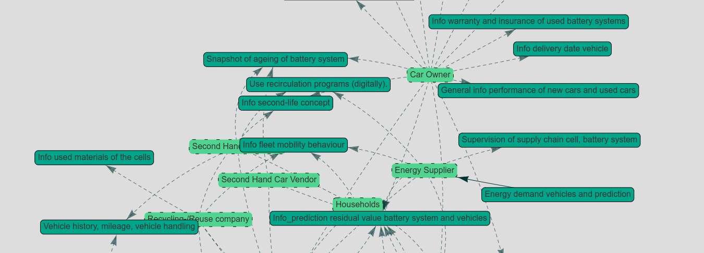

# Dataset of Stakeholder Analyses of Digital Battery Twin

During the work on the paper [info comming], a fair amount of data accumulated. Not all information made its way into the paper. To supplement the information and show the full database, we created this repository. 

Following the link, you will get to a website showing the whole dataset in a vis.js graph.

[>>Open network on github pages<<](https://tumftm.github.io/stakeholder-digital-battery-twin/index.html)

## Paper
Paper will be linked here when published.

## Contact
[Lukas Merkle](https://www.ftm.mw.tum.de/en/institute/staff/smarte-mobilitaet/lukas-merkle-msc/lukas-merkle-m-sc/)  
lukas.merkle@tum.de  
[Institute of Automotive Technology](https://www.ftm.mw.tum.de/en/home/)  
Technical University of Munich
